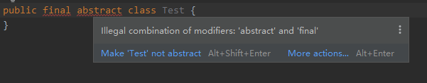

# 基本知识

## Java 的8种基本数据类型 及其大小？


## Java 基本类型与引用类型的区别？

基本类型保存的是原始值，引用类型保存的是引用值（引用值就是指对象在堆中所 处的位置/地址）

## 自动装箱和拆箱是什么

自动装箱是Java 编译器在 基本数据类型 和 对应的对象包装类型 之间做的一个转化。

比如：把int转化成 Integer，double转化成 Double，等等。反之就是自动拆箱。

原始类型: boolean，char，byte，short，int，long，float，double 

封装类型：Boolean，Character，Byte，Short，Integer，Long，Float，Double

装箱：将基本类型用它们对应的引用类型包装起来；

拆箱：将包装类型转换为基本数据类型；

## Java中private、protected、public和default的区别


## 字节与字符的区别？

字节是存储容量的基本单位。

字符是数字，字母，汉字以及其他语言的各种符号。

1 字节=8 个二进制单位：一个字符由一个字节或多个字节的二进制单位组成。

## JDK 和 JRE 的区别？

JDK：Java Development Kit 的简称，Java 开发工具包，提供了 Java 的开发环境和运行环境。

JRE：Java Runtime Environment 的简称，Java 运行环境，为 Java 的运行提供了所需环境。 

具体来说 ：JDK 其实包含了 JRE，同时还包含了编译 Java 源码的编译器 Javac，还包含了很多 Java 程序调试和分析的工具。

简单来说：如果你需要运行 Java 程序，只需安装 JRE 就可以了，如果你需要编写 Java 程序，需要安装 JDK。

## 重载和重写的区别?

方法的重载和重写都是实现多态的方式，区别在于重载实现的是编译时的多态性，而重写实现的是运行时的多态性。

**重载**发生在一个类中，同名的方法如果有不同的参数列表（类型、个数、顺序）则视为重载。重载对返回类型没有特殊的要求。

**重写**发生在子类与父类之间，重写要求子类重写之后的方法与 父类被重写方法 有相同的返回类型，访问权限不能比父类更低，不能抛出更宽泛的异常；

### 方法重载的规则：

- 方法名一致，参数列表中参数的顺序，类型，个数不同。
- 重载与方法的返回值无关。
- 可以抛出不同的异常，可以有不同修饰符。

### 方法重写的规则：

- 参数列表、方法名、返回值类型必须完全一致；
- 构造方法不能被重写；
- 声明为 final 的方法不能被重写；
- 声明为 static 的方法不存在重写（重写和多态联合才有意义）；
- 访问权限不能比父类更低；
- 重写之后的方法不能抛出更宽泛的异常；

## 面向对象和面向过程的区别

**面向过程：**面向过程性能比面向对象高。 因为面向对象的类调用时需要实例化，开销比较大，比较消耗资源，所以当性能是最重要的考量因素的时候，比如单片机、嵌入式开发、Linux/Unix等一般采用面向过程开发。但是，面向过程没有面向对象易维护、易复用、易扩展。

**面向对象：**面向对象易维护、易复用、易扩展。 因为面向对象有封装、继承、多态性的特性，所以可以设计出低耦合的系统，使系统更加灵活、更加易于维护。但是，面向对象性能比面向过程低。

## 面向对象的三个特征

封装，继承，多态

## 多态的好处

允许不同类对象对同一消息做出不同响应，即同一消息可以根据发送对象的不同，而采用多种不同的行为方式(发送消息就是函数调用)。

## 代码中如何实现多态

实现多态主要有以下三种方式：

1.接口实现

2.继承父类重写方法

3.同一类中进行方法重载

## static 关键字的理解？

- 修饰成员变量和成员方法: 被 static 修饰的成员属于类，不属于这个类的某个对象，被类中所有对象共享，可以并且通过 类名.静态变量名， 类名.静态方法名()来调用。
- 静态代码块: 静态代码块定义在类中方法外, 静态代码块在非静态代码块之前执行(静态代码块—>非静态代码块—>构造方法)。 该类不管创建多少对象，静态代码块只执行一次.
- 静态内部类（static修饰类的话只能修饰内部类）： 静态内部类与非静态内部类之间存在一个最大的区别: 非静态内部类在编译完成之后会隐含地保存着一个引用，该引用是指向创建它的外围类，但是静态内部类却没有。没有这个引用就意味着：
  1. 它的创建是不需要依赖外围类的创建。
  2. 它不能使用任何外围类的非静态成员变量和方法。
- 静态导包(用来导入类中的静态资源，1.5之后的新特性): 格式为：import static 这两个关键字连用可以指定导入某个类中的指定静态资源，并且不需要使用类名调用类中静态成员，可以直接使用导入类中静态成员变量和成员方法。

## 静态变量和实例变量的区别?

静态变量存储在方法区，属于类的所有。实例变量存储在堆当中，其引用存在当前线程栈上。

## 静态方法和实例方法有何不同

首先调用**静态方法**是可以直接通过 **类名.方法名 **或者 **对象名.方法名** 来调用，但是对于 **实例方法 **只能使用 **对象名.方法名**  的方式。

**静态方法 **在访问本类的成员时，只允许访问静态成员（即静态变量和静态方法），而不允许访问实例成员（即实例变量和实例方法）；而**实例方法**则无此限制。

## 构造方法有哪些特性？

- 名字与类名相同。
- 没有返回值，但不能用void声明构造函数。
- 生成类的对象时自动执行，无需调用。

## 普通类和抽象类有哪些区别？

- 普通类不能包含抽象方法，抽象类可以包含抽象方法。
- 抽象类是不能被实例化的，就是不能用new调出构造方法创建对象，普通类可以直接实例化。
- 如果一个类继承于抽象类，则该子类必须实现父类的抽象方法。如果子类没有实现父类的抽象方法，则必须将子类也定义为abstract类。

## 抽象类和接口的区别是什么？

**实现方式：**抽象类的子类使用 extends 来继承；接口的实现类必须使用 implements 来实现接口。

**实例化：**抽象类和接口都不能实例化。

**构造函数：**抽象类可以有构造函数；接口不能有。

**实现数量：**类可以实现很多个接口；但只能继承一个抽象类【java只支持单继承】。

**访问修饰符：**抽象类中的抽象方法可以使用Public、Protected 和default修饰，接口中的方法默认使用 public 修饰，不能使用private；

**默认方法：** 抽象类可以有默认方法的实现，接口在Java8之后也可以有默认方法的实现。

**变量：**抽象类和普通类一样，而接口中除了static、final变量之外不能有其他变量。

## 在抽象类中 为什么有构造方法

因为在初始化一个类的时候，都会先初始化父类，不管父类是不是抽象类都会调用父类的构造方法，所以在抽象类中会有构造方法。

## 抽象类必须要有抽象方法吗？

不需要，抽象类不一定非要有抽象方法；但是包含一个抽象方法的类一定是抽象类。

## 抽象类能使用 final 修饰吗？

不能，定义抽象类就是让其他类继承的，如果定义为 final 该类就不能被继承，这样彼此就会产生矛盾，所以 final 不能修饰抽象类，如下图所示，编辑器也会提示错误信息：



## Java类的初始化顺序


## final有哪些用法

1.被final修饰的类叫最终类，该类不能被继承。

2.被final修饰的方法不可以被重写

3.被final修饰的变量不可以被改变，也就意味着该变量的值在初始化后不能被改变。

- 如果修饰引用变量则表示引用变量不可变， 但引用变量指向的内容可变。（常量不可改变的意思）

4.被final修饰的方法，JVM会尝试将其内联，以提高运行效率

5.被final修饰的常量，在编译阶段会存入常量池中。

## final,finalize和finally的不同之处

**final是**一个修饰符，可以修饰变量、方法和类。被final修饰的类不能被继承，修饰的方法不可以被重写，修饰的变量不可以被改变。

**finalize**方法是在对象被回收之前调用的方法，给对象自己最后一个复活的机会，但是什么时候调用finalize没有保证。

finally是一个关键字，与try和catch一起用于异常的处理，无论在try块中是否有发生异常，finally语句块一定会被执行。

## 什么是不可变对象

不可变对象指对象一旦被创建，状态就不能再改变。任何修改都会创建一个新的对象，如String、Integer及其它包装类。

## super 关键字的理解

super关键字用于从子类访问父类的变量和方法。 

## 使用 this 和 super 要注意的问题？

- 在子类构造器中使用 super（） 调用父类中的其他构造方法时，该语句必须处于构造器的首行，否则编译器会报错。另外，this 调用本类中的其他构造方法时，也要放在首行。
- this、super不能用在static方法中。
  - 被 static 修饰的成员属于类，不属于这个类的某个对象，被类中所有对象共享。而 this 代表对本类对象的引用，指向本类对象；而 super 代表对父类对象的引用，指向父类对象；所以， this和super是属于对象范畴的东西，而静态方法是属于类范畴的东西。

## == 与 equals 的区别？

== 对于基本类型来说是值比较，对于引用类型来说是比较的是引用；而 equals 默认情况下是引用比较，只是很多类重新了 equals 方法，比如 String、Integer 等把它变成了值比较，所以一般情况下 equals 比较的是值是否相等。

## 两个对象的 hashCode() 相同，则 equals() 也一定为 true，对吗？

不对，两个对象的 hashCode() 相同，equals() 不一定 true。

## hashCode 与 equals

面试官可能会问你：“你重写过 hashcode 和 equals 么，为什么重写 equals时必须重写 hashCode 方法？”

### hashCode（）介绍

hashCode() 的作用是获取哈希码，也称为散列码；，它实际上是返回一个 int 整数。这个哈希码的作用是确定该对象在哈希表中的索引位置。哈希表存储的是键值对(key-value)，它的特点是：能根据“键”快速的检索出对应的“值”。这其中就利用到了哈希码！（可以快速找到所需要的对象）hashCode() 定义在 JDK 的 Object.java 中，这就意味着 Java 中的任何类都包含有 hashCode() 函数。

### 为什么要有 hashCode

当你把对象加入 HashSet 时，HashSet 会先计算对象的 hashcode 值来判断对象加入的位置，同时也会与其他已经加入的对象的 hashcode 值作比较，如果没有相符的 hashcode，HashSet 会假设对象没有重复出现。但是如果发现有相同 hashcode 值的对象，这时会调用 equals（）方法来检查 hashcode 相等的对象是否真的相同。如果两者相同，HashSet 就不会让其加入操作成功。如果不同的话，就会重新散列到其他位置。（摘自我的 Java 启蒙书《Head first java》第二版）。这样我们就大大减少了 equals 的次数，相应就大大提高了执行速度。

### hashCode（）与 equals（）的相关规定

1.  如果两个对象相等，则 hashcode 一定也是相同的，对两个对象分别调用 equals 方法都返回 true

2.  两个对象有相同的 hashcode 值，它们也不一定是相等的

3.  因此，equals 方法被覆盖过，则 hashCode 方法也必须被覆盖

4.  hashCode() 的默认行为是对堆上的对象产生独特值。如果没有重写hashCode()，则这两个对象无论如何都不会相等（即使这两个对象指向相同的数据）

## &和&&的区别

首先记住&是位操作，而&&是逻辑运算符。另外需要记住逻辑运算符具有短路特性，而&不具备短路特性。

### **短路特性**

(表达式答1）&& (表达式2)  如果表达式1为假，则表达式2不会进行运算，即表达式2“被短路”
(表达式1）|| (表达式2)  如果表达式1为真，则表达式2不会进行运算，即表达式2“被短路”

## 深拷贝和浅拷贝的区别是什么?

浅拷贝：只复制对象包含的**值类型**的成员变量，而**引用类型**的成员变量依然指向 相同的引用地址 。

深拷贝：除了对象本身被复制外，对象所包含的所有成员变量都会被复制，包括引用类型的成员变量会 引用新的地址 。

## Java 当中的四种引用

强引用，软引用，弱引用，虚引用。不同的引用类型主要体现在 GC 上:

**强引用：**如果一个对象具有强引用，它就不会被垃圾回收器回收。即使当前内存空间不足，JVM 也不会回收它，而是抛出 OutOfMemoryError  错误，使程序异常终止。如果想中断强引用和某个对象之间的关联，可以显式地将引用赋值为 null，这样一来的话，JVM 在合适的时间就会回收该对象。

**软引用：**在使用软引用时，如果内存的空间足够，软引用就能继续被使用，而不会被垃圾回收器回收，只有在内存不足时，软引用才会被垃圾回收器回收。

**弱引用：**具有弱引用的对象拥有的生命周期更短暂。因为当 JVM  进行垃圾回收，一旦发现弱引用对象，无论当前内存空间是否充足，都会将弱引用回收。不过由于垃圾回收器是一个优先级较低的线程，所以并不一定能迅速发现弱引用对象。

**虚引用：**顾名思义，就是形同虚设，如果一个对象仅持有虚引用，那么它相当于没有引用，在任何时候都可能被垃圾回收器回收。

## WeakReference （弱引用）与 SoftReference（软引用）的区别?

首先 WeakReference  与 SoftReference   都 有利 于 提 高 GC  和 内 存的 效 率 ，但 是WeakReference   ，无论当前内存空间是否充足，当 JVM  进行垃圾回收时就会被 GC  回收，而SoftReference虽然不能阻止被回收，但是可以延迟到 JVM  内存不足的时候。

## 什么是 Java 序列化？什么情况下需要序列化？

Java 序列化是为了保存各种对象在内存中的状态，并且可以把保存的对象状态再读出来。

以下情况需要使用 Java 序列化：

1. 想把的内存中的对象状态保存到一个文件中或者数据库中时候；
2. 想用套接字在网络上传送对象的时候；
3. 想通过RMI（远程方法调用）传输对象的时候。

##  Java序列化中如果有些字段不想进行序列化，怎么办？

对于不想进行序列化的变量，使用transient关键字修饰。

transient关键字的作用是：当对象被序列化/反序列化时，被transient修饰的变量值不会被持久化和恢复。然后transient只能修饰变量，不能修饰类和方法。

# IO

## Java 中 IO 流分为几种?

按功能来分：输入流（input）、输出流（output）。 

按类型来分：字节流和字符流。 

字节流和字符流的区别是：字节流按 8 位行传输以字节为单位输入输出数据，字符流按 16 位传输以字符为单位输入输出数据。

## 既然有了字节流,为什么还要有字符流?

字符流是由 Java 虚拟机将字节转换得到的，问题就出在这个过程还算是非常耗时，并且，如果不知道编码类型就很容易出现乱码问题。所以， I/O 流就干脆提供了一个直接操作字符的接口，方便我们平时对字符进行流操作。如果音频文件、图片等媒体文件用字节流比较好，如果涉及到字符的话使用字符流比较好。

## BIO、NIO、AIO 有什么区别?

- BIO (Blocking I/O): 同步阻塞I/O模式，数据的读取写入必须阻塞在一个线程内等待其完成。在活动连接数不是特别高（小于单机1000）的情况下，这种模型是比较不错的，可以让每一个连接专注于自己的 I/O 并且编程模型简单，也不用过多考虑系统的过载、限流等问题。线程池本身就是一个天然的漏斗，可以缓冲一些系统处理不了的连接或请求。但是，当面对十万甚至百万级连接的时候，传统的 BIO 模型是无能为力的。因此，我们需要一种更高效的 I/O 处理模型来应对更高的并发量。

- NIO (New I/O): NIO是一种同步非阻塞的I/O模型，在Java 1.4 中引入了NIO框架，对应 java.nio 包，提供了 Channel , Selector，Buffer等抽象。NIO中的N可以理解为Non-blocking，不单纯是New。它支持面向缓冲的，基于通道的I/O操作方法。 NIO提供了与传统BIO模型中的 Socket 和 ServerSocket 相对应的 SocketChannel 和 ServerSocketChannel 两种不同的套接字通道实现,两种通道都支持阻塞和非阻塞两种模式。阻塞模式使用就像传统中的支持一样，比较简单，但是性能和可靠性都不好；非阻塞模式正好与之相反。对于低负载、低并发的应用程序，可以使用同步阻塞I/O来提升开发速率和更好的维护性；对于高负载、高并发的（网络）应用，应使用 NIO 的非阻塞模式来开发

- AIO (Asynchronous I/O): AIO 也就是 NIO 2。在 Java 7 中引入了 NIO 的改进版 NIO 2,它是异步非阻塞的IO模型。异步 IO 是基于事件和回调机制实现的，也就是应用操作之后会直接返回，不会堵塞在那里，当后台处理完成，操作系统会通知相应的线程进行后续的操作。AIO 是异步IO的缩写，虽然 NIO 在网络操作中，提供了非阻塞的方法，但是 NIO 的 IO 行为还是同步的。对于 NIO 来说，我们的业务线程是在 IO 操作准备好时，得到通知，接着就由这个线程自行进行 IO 操作，IO操作本身是同步的。查阅网上相关资料，我发现就目前来说 AIO 的应用还不是很广泛，Netty 之前也尝试使用过 AIO，不过又放弃了。

## Nio

### nio介绍

NIO即New IO，这个库是在JDK1.4中才引入的。NIO和IO有相同的作用和目的，但实现方式不同，NIO主要用到的是块，所以NIO的效率要比IO高很多。在Java API中提供了两套NIO，一套是针对标准输入输出NIO，另一套就是网络编程NIO。

### Buffer参数

- capacity（容量）：缓冲区的容量，不可以为负数，一旦创建了就不能够改变

- limit（界限）：是缓冲区读写数据的终止点，limit之后的区域无法访问

- position（起始指针）：是缓冲区读写数据的起始点，初始值为0。position随着数据的加入而改变，例如读取2个数据到Buffer中，则position = 2

- mark（标记）：该索引能够用于下次读取或者写入，mark在0~position之间，设置该值就会把position移动到mark处


### Buffer方法

- flip()：读取模式；确定缓冲区数据的起始点和终止点，为输出数据做准备(即写入通道)， 将limit的值改为postion的值，同时将postion归0

特点: 就是为下一次数据的读取做好准备

- clear()：写入模式；缓冲区初始化，准备再次接收新数据到缓冲区，将limit改为capacity的值，同时将postion归0

特点: 就是为下一次数据的写入做好准备

- get()和put()：获取元素和存放元素。使用clear()之后，无法直接使用get()获取元素，需要使用get(int index)根据索引值来获取相应元素

- hasRemaining()：判断postion到limit之间是否还有元素。

### Channel(通道)

Channel原理类似于传统的流对象，区别在于：

1.Channel能够将指定的部分或者全部文件映射到内存中

2.程序如果想要读取Channel中的数据，不能够直接读写，必须经过Buffer

简单来说：Channel通过Buffer(缓冲区)进行读写操作。read()表示 读取通道数据 到缓冲区，write()表示把 缓冲区数据 写入到通道。

### Channel实现类

- FileChannel 和文件相关的通道
- DatagramChannel 和UDP协议传输数据相关的通道
- SocketChannel 和TCP协议相关的数据传输通道
- ServerSocket 和TCP协议相关的数据传输通道
- Pipe.SinkChannel、Pipe.SourceChannel //线程通信管道传输数据

### Selector（选择器）介绍

我们的NIO模拟的I/O模型就是I/O复用模型。通过只阻塞Selector这一个线程，通过Selector不断的查询Channel中的状态，从而达到了一个线程控制Selector，而一个Selector控制多个Channel的目的。用图表示就是这样。


通过调用Selector.open()方法来创建一个Selector。

```java
Selector selector = Selector.open();
```

### Selector监听的四种事件

- SelectionKey.OP_CONNECT：连接继续事件，表示服务器监听到了客户连接，服务器可以接收这个连接了

- SelectionKey.OP_ACCEPT：连接就绪事件，服务端收到客户端的一个连接请求会触发

- SelectionKey.OP_READ：读就绪事件，表示通道中已经有可读的数据了，可以执行读操作

- SelectionKey.OP_WRITE：写就绪事件，表示已经可以向通道写数据了

## NIO空轮询的bug

这个bug是指 java的NIO在linux下selector.select()时，本来如果轮询的结果为空并且不调用wakeup的方法的话，这个selector.select()应该是一直阻塞的，但是java却会打破阻塞，继续执行，导致程序无限空转，造成CPU使用率100%


这个bug只出现在linux系统下，因为linux下NIO底层使用的是epoll来实现的，而java的epoll实现存在bug，导致selector出现了这种轮询为空却唤醒的情况。windows下NIO是使用的poll来实现selector的就不存在这种bug

netty中解决了这个问题。


# 反射

## 反射 Class.forName 和 classLoader有什么区别

在Java中Class.forName()和ClassLoader都可以对类进行加载。

```java
public class Test {


    public static void main(String[] args) throws Exception{
        //static....
       Class.forName("TestClass");

        //static....
        // constructor...
        Class.forName("TestClass").newInstance();

        ClassLoader.getSystemClassLoader().loadClass("TestClass");

        //static....
        // constructor...
        ClassLoader.getSystemClassLoader().loadClass("TestClass").newInstance();
    }
}

class TestClass{

    static {
        System.out.println("static....");
    }

    public TestClass() {
        System.out.println("constructor...");
    }
}
```

**区别：**

（1）Class.forName除了将类的.class文件加载到jvm中之外，还会对类进行解释，执行类中的static块。

（2）而Classloader只干一件事情，就是将.class文件加载到jvm中，不会执行static中的内容，只有在newInstance才会去执行static块。

\#Class.forName(name,initialize,loader)带参数也可控制是否加载static块。并且只有调用了newInstance()方法采用调用构造函数，创建类的对象。

所以这就是为什么在JDBC进行数据库操作的时候要用Class.forName进行驱动的加载：Class.forName(“com.mysql.jdbc.Driver”)会进行class的初始化，执行static代码块。也就是说class初始化以后，就会将驱注册到DriverManageer上，之后才能通过DriverManager去获取相应的连接。但是要是我们使用ClassLoader.loadClass(com.mysql.jdbc.Driver)的话，不会link，更也不会初始化class。相应的就不会回将Driver注册到DriverManager上面，后面肯定不能通过DriverManager获取相应的连接。

## 反射的使用场景

代理模式，JDBC链接数据库，Spring的IOC

## 反射的缺点是什么？如何优化？

**缺点：**Java反射是要解析字节码，将内存中的对象进行解析，包括了一些动态类型，所以JVM无法对这些代码进行优化。因此，反射操作的效率要比那些非反射操作低得多！ 

### 提高反射性能的方式有哪些？

1. setAccessible(true),可以防止安全性检查（做这个很费时）
2. 做缓存，把要经常访问的元数据信息放入内存中，class.forName 太耗时
3. getMethods() 等方法尽量少用，尽量调用getMethod(name)指定方法的名称，减少遍历次数

## 什么是动态代理，怎么实现动态代理？

**动态代理：**当想要给类中的方法加一些额外的处理。比如说加日志，加事务等。可以给这个类创建一个代理，顾名思议就是创建一个新的类（代理类），这个类不仅包含原来类方法的功能，而且还在原来的基础上添加了额外的处理。这个代理类并不是定义好的，是动态生成的。具有解耦意义，灵活，扩展性强。

**动态代理的实现（JDK动态代理）：**首先被代理的类必须实现一个接口，还要有一个InvocationHandler接口实现类实现invoke方法进行增强代码编写。再有一个工具类Proxy，调用他的newProxyInstance()可以产生代理对象，这个方法要利用到InvocationHandler接口的实现类，最后将实例化产生代理对象之后返回。

**动态代理的实现（CGLIB动态代理）：**实现方式根JDK动态代理差不多，首先要获取被代理的类，然后需要一个MethodInterceptor接口的实现类实现intercept方法进行增强代码编写。再利用Enhancer来生产被代理类，拦截方法，对方法进行前置和后置的代理增强。

因为基于JDK的动态代理的类一定要实现一个接口，对接口进行增强，而有些情况是基于POJO类的动态代理，那么CGLIB就是一个很好的选择，因为CGLIB是基于类的动态代理。

**动态代理的应用：**Spring的AOP，加事务，加权限，加日志。

## 静态代理模式和动态代理模式的区别

**静态：** 由程序员创建代理类。在程序运行前要代理的对象就已经指定了。

**动态：** 在程序运行时运用反射机制动态创建而成。(InvocationHandler的应用)

## JDK动态代理和CGLIB动态代理的区别

SpringAOP中的动态代理主要有两种方式，JDK动态代理和CGLIB动态代理：

（1）JDK动态代理只提供接口的代理，不支持类的代理。核心InvocationHandler接口和Proxy类，InvocationHandler通过invoke()方法反射来调用目标类中的代码，动态地将横切逻辑和业务编织在一起；接着，Proxy利用InvocationHandler动态创建一个符合某一接口的的实例,生成目标类的代理对象。

（2）如果代理类没有实现InvocationHandler接口，那么SpringAOP会选择使用CGLIB来动态代理目标类。CGLIB（CodeGenerationLibrary），是一个代码生成的类库，可以在运行时动态的生成指定类的一个子类对象，并覆盖其中特定方法并添加增强代码，从而实现AOP。CGLIB是通过继承的方式做的动态代理，因此如果某个类被标记为final，那么它是无法使用CGLIB做动态代理的。

静态代理与动态代理区别在于生成AOP代理对象的时机不同，相对来说AspectJ的静态代理方式具有更好的性能，但是AspectJ需要特定的编译器进行处理，而SpringAOP则无需特定的编译器处理。


# 异常

## 常见的异常类有哪些？

NullPointerException 空指针异常

ClassNotFoundException 指定类不存在

NumberFormatException 字符串转换为数字异常

IndexOutOfBoundsException 数组下标越界异常

ClassCastException 数据类型转换异常

FileNotFoundException 文件未找到异常

NoSuchMethodException 方法不存在异常

IOException IO 异常

SocketException Socket 异常

# 泛型


# 注解

